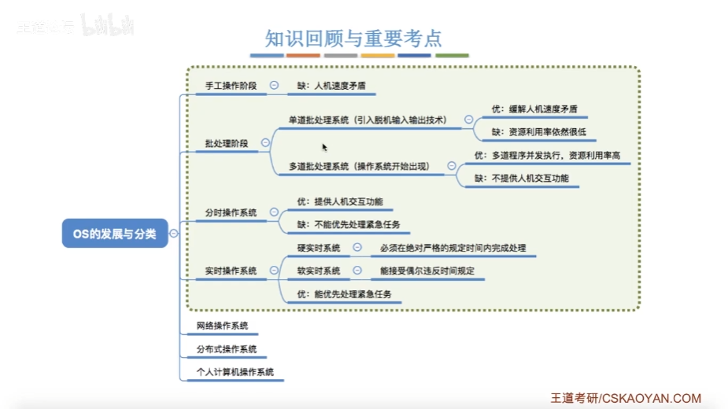
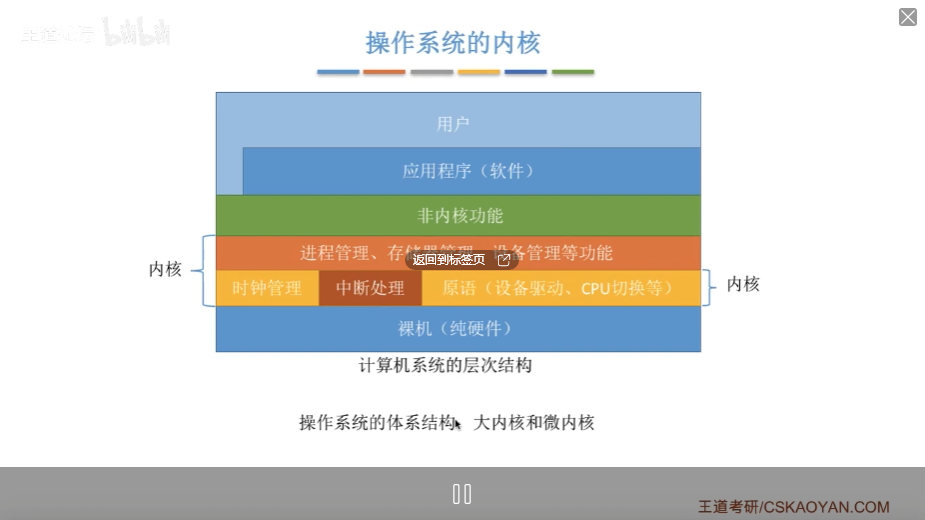
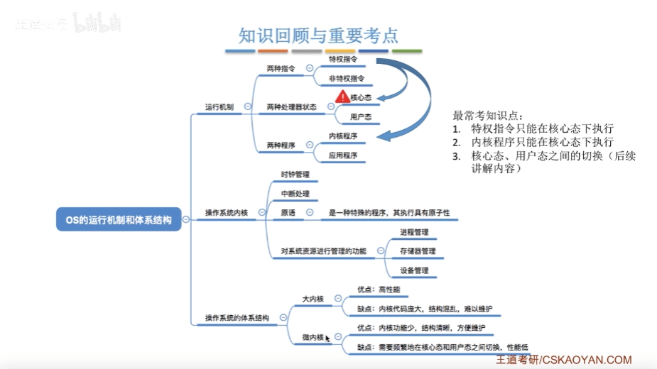
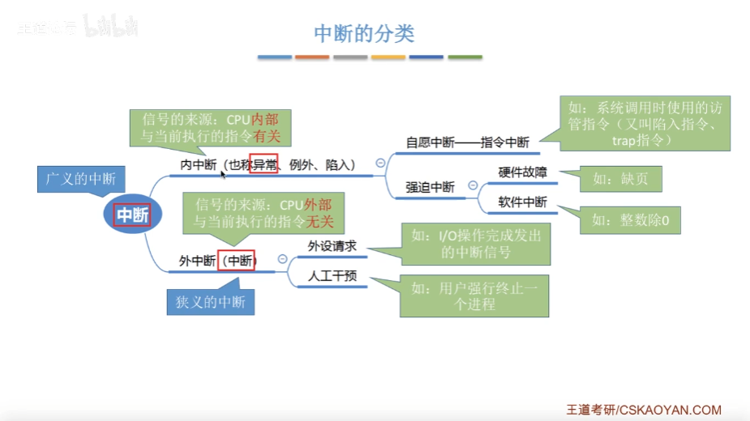
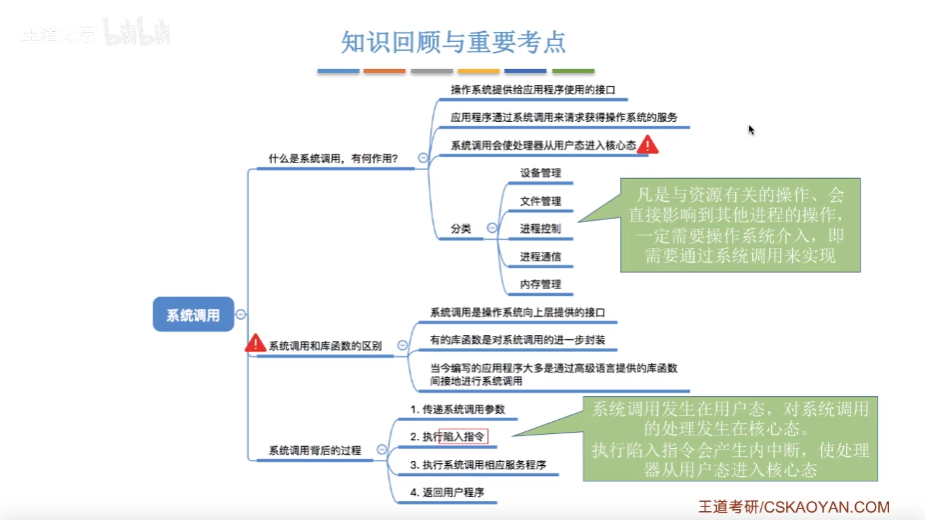
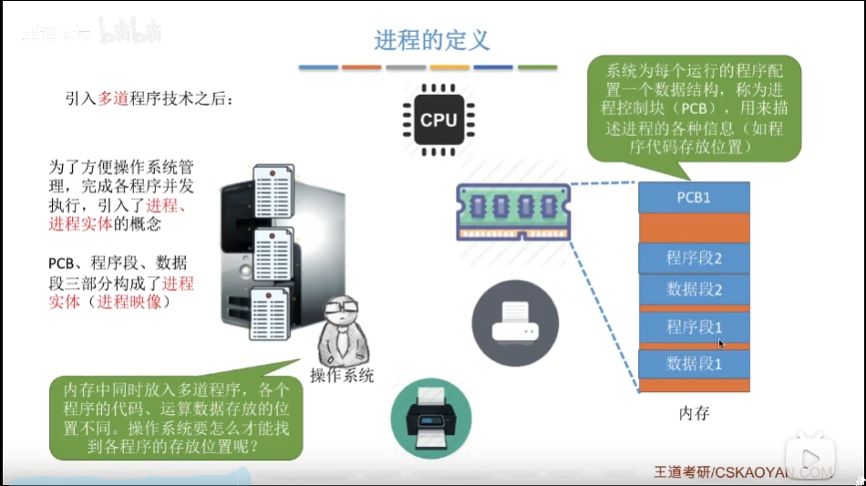

# 第一章

## 1.1 OS的发展与分类

## 1.2 指令

特权指令

非特权指令

## 1.3 内核

### 操作内核

### 操作内核的优缺点

## 1.4 中断和异常

### 中断的诞生

为了解决上述问题，人们发明了操作系统(作为计算机的管理者)，引入中断机制，实现了多道程序并发执行

本质:发生中断就意味着需要操作系统介入，开展管理工作

### 中断的概念和作用

1.当中断发生时，CPU立即进入核心态
2.当中断发生后，当前运行的进程暂停运行，并由操作系统内核对中断进行处理
3.对于不同的中断信号，会进行不同的处理
发生了中断，就意味着需要操作系统介入，开展管理工作。由于操作系统的管理工作(比如进程切换、
分配I/O设备等)需要使用特权指令，因此CPU要从用户态转为核心态。中断可以使CPU从用户态切换为
核心态，使操作系统获得计算机的控制权。有了中断，才能实现多道程序并发执行。

### 中断的分类

## 1.5 系统调用

## 1.6 系统调用与库函数的区别

# 第二章

## 2.1 进程

程序:就是一个指令序列早期的计算机(只支持单道程序) :

### 进程的定义

程序段、数据段、PCB三部分组成了进程实体(进程映像)。-般情况下，我们把进程实体就简称为进程,
例如，所谓创建进程，实质.上是创建进程实体中的PCB;而撤销进程，实质上是撤销进程实体中的PCB。

注意: PCB是进程存在的唯- -标志!

从不同的角度，进程可以有不同的定义，比较传统典型的定义有:

1.进程是程序的一次执行过程。
2.进程是一个程序及其数据在处理机上顺序执行时所发生的活动。
3.进程是具有独立功能的程序在数据集合上运行的过程，它是系统进行资源分配和调度的一个独立单位

引入进程实体的概念后，可把进程定义为:

进程是进程实体的运行过程，是系统进行资源分配和调度的- - 个独立单位。
注:严格来说，进程实体和进程并不-样，进程实体是静态的，进程则是动态的。不过，除非题目专门
考察二者区别，否则可以认为进程实体就是进程。因此我们也可以说“进程由程序段、数据段、PCB三部

### 进程的组织--链接方式

指针

### 进程的特征

动态性( 最基本的特性 )

并发性

独立性

异步性

结构性

