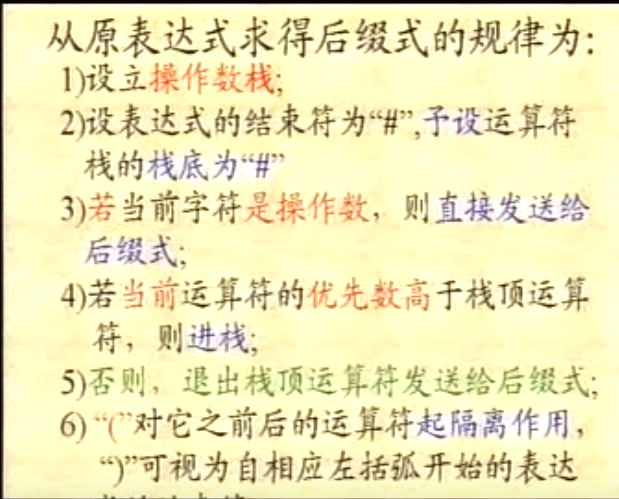
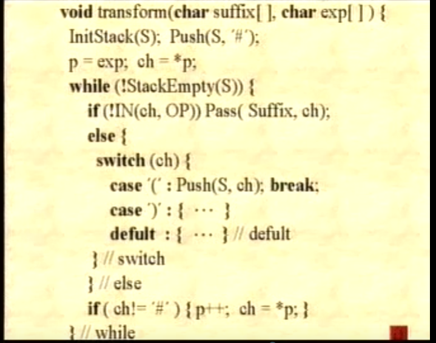
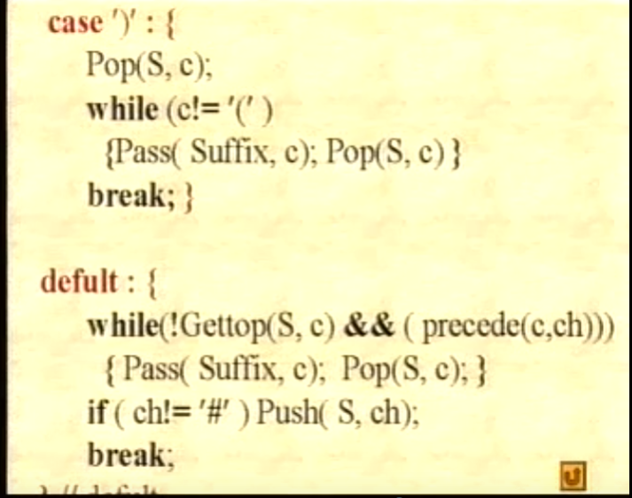

# 数据结构

# 第一章
## 1.1数据结构讨论讨论的范畴

程序设计+数据结构（） = 编程。

## 1.2数据与数据结构

数据：所有能被输入到计算机中,且被计算机处理的符号的集合计算机操作的对象的总称，是计算机处理的信息的某种特定的符号表示形式。


数据元素：数据中的一个“个体”，数据结构中讨论的基本单位。

数据项：最小单位

数据结构：带结构的数据元素的集合。

数据的逻辑结构可归结以下四类：
线性结构
树形结构
图状结构
集合结构

####数据的存储结构：映象

####关系映像：
线性映像

链式映像

####抽象数据类型
 特点：
 数据抽象

 数据封装

## 1.3算法和算法的衡量


# 第二章   线 性表 
线性结构是 一个数据元素的有序（次序）集。

线性结构的基本特征
1.集合中必存在唯一的一个“第一个元素”

2.集合中必存在唯一的一个“最后元素”

3.除最后元素在外，均有唯一的后继；

4.除第一个元素之外，均有唯一的钱去。


初始化

销毁

引用
## 2.1线性表的类型定义

## 2.2线性表类型的实现——顺序映像
```c++
#define MAXSIZE 10000                   //图书馆可能达到的最大长度
typedef struct
{
    char no[20];                        //图书ISBN
    char name[50];                      //图书名字
    float price;                         //图书价格
}book；

typedef struct
{
    book *elem;                        //存储空间的基地址
    int length;                        //图书表中当前图书的个数
}SqList;                               //图书表的顺序存储结构类型为SqList

//在上述定义后，可以通过变量定义语句
SqList L;
```

## 2.3线性表类型的实现——链式映像

单链表

```c++
#include<iostream>
#include<stdio.h>
using namespace std;
#define MAXSIZE 50
typedef struct Link
{
	int Elem;			//数组域
	Link* Next;			//指针域
	int length;			//指针长度
}Link;
Link* MakeEmpty()
{
	Link* PtrL;
	PtrL = new Link[MAXSIZE];
	PtrL->Elem = 0;
	PtrL->Next = NULL;
	PtrL->length = 0;
	return PtrL;
}
Link* InitLink(Link* L) 
{
	Link* p;
	p = new Link[MAXSIZE];
	p->Elem = 0;
	p->Next = NULL;
	p->length = 0;
	L = p;
	return L;
}
Link* Assignment(Link* L, int arr[],int len)
{
	for (int i = 0; i < len + 1; i++)
	{
		if (i == len)
		{
			Link* p = new Link;
			p->Elem = 0;
			p->length = i;
			p->Next = NULL;
			L = L->Next = p;
		}
		else
		{
			Link* p = new Link;
			p->Elem = arr[i];
			p->length = i;
			p->Next = NULL;
			L = L->Next = p;
			/*L->Elem = p->Elem;*/
		}
		
	}
	return L;
}

void print(Link* name,int len)
{
	
	for (int i = 0; i <len ; i++)
	{
		name = name->Next;
		printf("值：%d	序号：%d\n", name->Elem,name->length);
	}
}
void Insert(Link* L, int i, int num)
{
	Link* pre, * tmp;
	pre = L;
	int len = L->length;
	for (Link* j = L; j; j = j->Next)
	{
		if (j->length == i - 2)
		{
			pre = j;
		}
		if (j->length >= i - 1)
		{
			j->length++;
		}
	}
	
	if (pre == NULL&&i<4)
	{
		printf("输入的数值有误\n");
	}
	else
	{
		tmp = new Link;
		tmp->Elem = num;
		tmp->length = pre->length + 1;
		tmp->Next = pre->Next;
		pre->Next = tmp;

	}
	
}
#define ERROR -1

void Find(Link* L, int num)
{
	int i = 0;
	while (L)
	{
		L = L->Next;
		if (L->Elem == num)
		{
			printf("序号：%d值：%d\n", i + 1, L->Elem);
			return;
		}
		i++;
	}
	printf("无这个值");
}
Link* Reverse(Link* L)
{
	Link* p, * q;
	p = q= L;
	L = NULL;
	while (p)
	{
		q = p;
		p = p->Next;
		q->Next = L;
		L = q;
	}
	return L;
	/*Link* p,* q;
	p = L;
	L = NULL;
	while (p) 
	{
		q = p;
		p = p->Next;
		q->Next = L;
		L = q;
	}
	return L;*/


}

int main()
{
	int arr[5] = { 1,2,3,4,5 };
	Link* L;
	L = MakeEmpty();
	Assignment(L,arr,5);
	print(L,5);
	printf("\n");
	L = Reverse(L);
	print(L, 5);
	//Find(L, 5);
	//Insert(L, 5, 9);
	//print(L,6);
	system("pause");
	return 0;
}
```
双向链表
```c++
#include<iostream>
#include<stdlib.h>
using namespace std;
#define ElementType int 
typedef struct Node
{
	ElementType Date;
	Node* Next;
	Node* Prior;
}*DuLinkList;

DuLinkList InitList()
{
	DuLinkList p;
	p = new Node;
	p->Date = 0;
	p->Next = p;
	p->Prior = p;
	return p;
}
void Assignment(DuLinkList L,int arr[],int len)
{
	DuLinkList s,p;
	p = L;
	for (int i = 0; i < len; i++)
	{
		s = new Node;
		s->Date = arr[i];
		p->Next = s;
		s->Prior = p;
		s->Next = NULL;
		p = p->Next;
	}
}
void print(DuLinkList L)
{
	L = L->Next;
	while (L)
	{
		printf("%d\n", L->Date);
		L = L->Next;
	}
	printf("\n");
}
DuLinkList DestoyList(DuLinkList L)
{
	DuLinkList p;
	p = L;
	while (L)
	{
		p = p->Next;
		free(L);
		L = p;
	}
	return L;
}

DuLinkList GetElem(DuLinkList L, int i)
{
	int j = 0;
	while (L && j < i)
	{
		L = L->Next;
		j++;
	}
	return L;
}

//在第i个元素之前插入数据e
int ListInsert(DuLinkList &L, int i, ElementType e)
{
	DuLinkList p,q;
	q = new Node;
	p = GetElem(L, i);
	if (!p)
	{
		return 0;
	}
	q->Date = e;
	p->Prior->Next = q;
	q->Prior = p->Prior;
	q->Next = p;
	p->Prior = q;
	return 1;
}
int ListDelete(DuLinkList& L, int i)
{
	DuLinkList p;
	p = GetElem(L, i);
	if (!p)
	{
		return 0;
	}
	p->Prior->Next = p->Next;
	p->Next->Prior = p->Prior;
	delete p;
	return 1;
}


int main()
{
	int arr[5] = { 1,2,3,4,5,};

	DuLinkList L;
	L = InitList();
	Assignment(L,arr,5);
	print(L);
	ListInsert(L, 5, 9);
	print(L);
	ListDelete(L, 5);
	print(L);

}
```
## 2.4一元多项式的表示
## 2.5 一些常用的排序算法

```c++
void include<stdio.h>bubble_sort(int a[],int n)
{
    int i,j;
    int temp;
    for(i=n-1,change=true;i>1&&change;--i)
    {
        change = FALSE；
        for(j=0;j<i;++j)
        {
            if(a[j]>a[j+1])
            {
                temp = a[j];
                a[j] = a[j+1];
                a[j+1] = temp;
            }
        }
    }
}
int main()
{
    int a[5]={5,4,3,2,1}
    bubble_sort(a,5);
    return 0;
}
 ```
 A集合插入B集合不相同的元素
 ```c
 void union(list &La,list Lb)
 {
     La_len = listlength(La);
     Lb_len = listlength(Lb);//求线性表长度
     for(i = 1;i<=Lb_len;i++)
     {
         GetElem(Lb,i,e);//取Lb中第i个数据元素赋给e
         if(iLocateElem(La,e,equal()))
         {
             ListInsert(La,++La_len1,e);
             //La中不存在和e相同的数据元素，则插入之
         }
     }//union
 }
 ```

A集合插入B空集合，并且各元素不相同

```c
void purge (List& La, List Lb ) 
{
    //已知线性表Lb中包含非纯集合B中所
    //有元素，试构造线性表La,使La中
    //只含Lb中所有值均不相同的元素
    InitLis(La); //设置空的线性表La
    La_len = ListLength(La);
    Lb_len = Listlength(Lb);
    //求线性表的长度
    for(i=1;i<=Lb_ len;i++ ) 
    {
    GetElem(Lb,i,e);
    //从线性表Lh中取第i个元素
    if(!LocateElem(La.c, equal() )
    {
        ++1a_len;
        ListInsert(La,La_len, e);
        //元素e插入线性表La
    }//if
    }//for
}
```

```c
void MergeList(List La, List Lb, List &Lc)
{
    InitList(Lc);
    i=j=1;k=0;
    La_len = ListLength(La);
    Lb_len = ListLength(Lb);
    while(i<= La_len) &&(j<=Lb_len) 
    {
        //La和Lb均非空
        GetElem(La,i,ai);
        GetElem(Lb,j,bj);
        if(ai<= bj)
        {
            ListInsert(Le, ++k, ai); ++i
        }
        else
        { 
            ListInsert(Lc, ++k, bj); 
            ++j;
        }
    }
}
```

# 第三章   栈和队列

## 3.1 迷宫


## 3.2 表达式







## 3.3 顺序栈

```c++
#include<iostream>
using namespace std;

#define MAXSIZE 100
#define SElemType int
#define OK 1
#define ERROR 0;
typedef struct SqStack
{
	SElemType* base;
	SElemType* top;
	int stacksize;
};

int InitStack(SqStack& S)
{//为动态数组分配一个最大容量的长度
	S.base = new SElemType[MAXSIZE];                  
	if (!S.base)
	{
		exit(OVERFLOW);
	}
	S.top = S.base;
	S.stacksize = MAXSIZE;
	return OK;
}

int Push(SqStack& S, SElemType e)
{
	//插入元素e为新的栈顶元素
	if (S.top - S.base == S.stacksize)
	{
		return ERROR;//栈满
	}
	*S.top++ = e;
	return OK;
}
int Pop(SqStack& S, SElemType& e)
{
	//删除S的栈顶元素，用e返回其值
	if (S.top == S.base)
	{
		return ERROR;
	}
	//栈空
	e = *--S.top;
	return OK;
}
int GetTop(SqStack S)
{
	if (S.top != S.base)
	{
		return *(S.top - 1);
	}
}
void print(SqStack S)
{
	while (S.top && S.base < S.top)
	{
		printf("%d\t", *S.base);
		S.base++;
	}
}

int main()
{
	int arr[5] = { 1,2,3,4,5 };
	SqStack S;
	InitStack(S);
	for (int i = 0; i < 5; i++)
	{
		Push(S, arr[i]);
	}
	print(S);
	printf("\n%d", *S.base);
	printf("\n%d", *S.top);
	int x = Pop(S, x);
	print(S);
	printf("\n%d", x);
	int y = GetTop(S);
	printf("\n%d", y);
	printf("\n%d\n", *S.top);
	system("pause");
	return 0;
}
```

## 3.4 链式栈

```c++
#include<iostream>
using namespace std;

#define MAXSIZE 100
#define ElemType int
#define SElemType int
#define OK 1
#define ERROR 0 

typedef struct StackNode
{
	ElemType data;
	StackNode* Next;
}* LinkStack;


int InitStack(LinkStack& S)
{
	S = NULL;
	return OK;
}

//入栈
int Push(LinkStack& S, SElemType e)
{//在栈顶插入元素(前插入法）
	LinkStack p;
	p = new StackNode;
	p->data = e;
	p->Next = S;
	S = p;
	return OK;
}
int Pop(LinkStack& S, SElemType& e)
{//删除S的栈顶元素，用e返回其值
	LinkStack p;
	if (S == NULL)
	{
		return ERROR;
	}
	e = S->data;
	p = S;
	S = S->Next;
	delete p;
	return OK;
};
void print(LinkStack S)
{
	while (S)
	{
		printf("%d\t", S->data);
		S = S->Next;
	}
}
SElemType GetTop(LinkStack S)
{//返回S的栈顶元素，不修改栈顶指针
	if (S != NULL)
	{
		return S->data;
	}
}

int main()
{
	int arr[5] = { 1,2,3,4,5 };
	LinkStack S;
	InitStack(S);
 	for (int i = 0; i < 5; i++)
	{
		Push(S, arr[i]);
	}
	print(S);
	int x;
	Pop(S, x);
	printf("\n");
	printf("%d\n", x);
	print(S);
	int y = GetTop(S);
	printf("\n%d", y);


	printf("\n");
	system("pause");
	return 0;
}
```

## 3.5 递归与栈

# 第四章 串和广义表

## 4.1 串的抽象数据类型的定义

* ADT String{
数据对象:D-{aa(CharacterSet. i=l,2…..n>0}
数据关系:R1={<aj4>|4.ja(D, i=2.,n }


## 4.2 串的表示和实现


## 4.3 串的模式匹配算法


